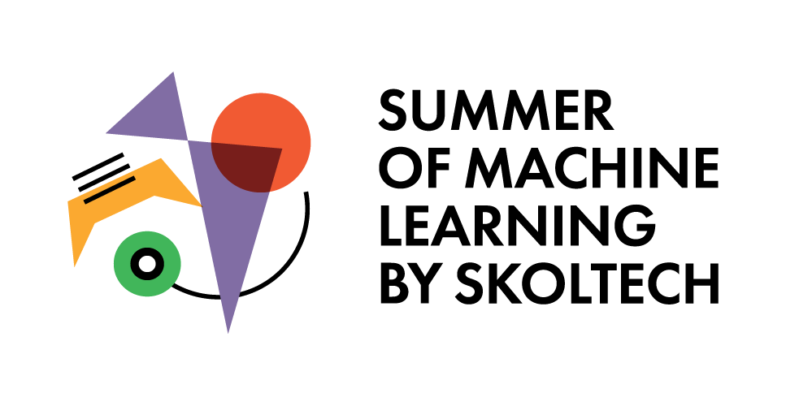

>❗**NOTE:** the best students projects will be included into SMILES Proceedings -- the collection of students' reports. To save you time, we advise you to **copy and paste** some of the parts from `README_curators` (into `README_students` and further into **LaTeX** for the best results). These parts will be marked as **❗Copy-Paste❗**.

>❗**NOTE:** all the sections presented here **are obligatory**. 

# 🌟 Your project title

**GitHub Repository: `your-repo-name`**

**❗Copy-Paste❗** The first paragraph from `README_curators.md`. This will be an analogue of `ABSTRACT` of research papers. 

# Problem statement 
**❗Copy-Paste❗**

# Methodology 
> In this section, briefly but exhaustively describe datasets and methods. It should be clear how the methods used to solve the tasks. 

# Results 
> Add here all the obtained results, including all necessary tables and figures.

> For your convenience, we recommend placing all your figures in the `figures/` folder.

 

# Conclusion 
> In this section, summarize and analyze the obtained results. If your solution has limitations or you plan to continue working on a project, you can add this information here or create the responding sections. 
